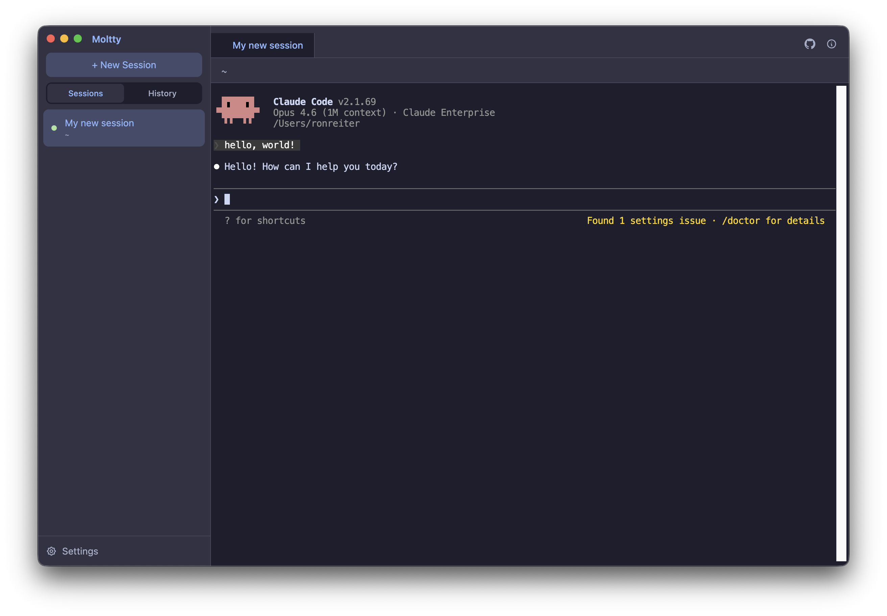

# Moltty — Organized, Persistent AI Coding Sessions

**[moltty.com](https://moltty.com)**

A native macOS terminal app for AI coding tools. Run Claude Code, Gemini CLI, Codex, Aider, OpenCode, or GitHub Copilot in a tabbed, persistent terminal with a clean UI. Restart the app, reboot your Mac — your sessions pick up right where you left off.




## Features

- **Multi-tool support** — Choose your AI coding tool on first launch: Claude Code, OpenCode, Gemini CLI, Codex, Aider, GitHub Copilot, or Amp
- **Tabbed sessions** — Run multiple sessions side by side with drag-and-drop tab reordering
- **Session persistence** — Close Moltty, restart your Mac — all your sessions automatically resume right where you left off. Works with every supported tool.
- **Folders & color labels** — Organize sessions into collapsible folders (drag-and-drop) and tag them with colors for visual grouping. Sessions sort with the most recently active ones at the top.
- **Built-in code editor** — Click any file path in the terminal to open it in a Monaco-based side pane (the same editor that powers VS Code). Edit, save with Cmd+S.
- **Live git branch** — The current branch is shown in the header and refreshes every 10 seconds, so you always know which branch the active session is on.
- **Session history** — Browse and resume any previous conversation
- **Native terminal** — Full xterm.js terminal with WebGL rendering, search (Cmd+F), and scrollback
- **Shell integration** — Optionally loads your `.zshrc` so your full environment is available
- **Catppuccin theme** — Beautiful dark terminal theme out of the box

## Install

Download the latest `.dmg` from [Releases](https://github.com/ronreiter/moltty/releases), open it, and drag Moltty to Applications.

### Build from source

This project uses [Task](https://taskfile.dev/) as a task runner. Install it with `brew install go-task`.

```bash
task install    # Install dependencies
task dev        # Run in development mode
task build      # Build the app
task package    # Build + package into a DMG
task release    # Package + create a GitHub release
task test       # Run Playwright tests
task clean      # Remove build artifacts
```

The DMG will be in `client/release/`.

You can also build manually without Task:

```bash
cd client
npm install
npm run build
npm run package
```

## Prerequisites

- macOS (Apple Silicon or Intel)
- Your chosen AI coding tool installed and available in your PATH (e.g. `claude`, `gemini`, `codex`)
- Node.js 20+ (for building from source)

## Usage

1. **First launch** — Pick your AI coding tool and configure shell settings in the onboarding wizard
2. **New session** — Click "+ New Session" in the sidebar, pick a working directory
3. **Switch tabs** — Click tabs or use Cmd+Left/Right
4. **Resume sessions** — Check the History tab to resume previous conversations
5. **Settings** — Click the gear icon in the sidebar to change your tool or shell config

Settings are stored in `~/.moltty.settings`.

## Project Structure

```
client/
  src/
    main/               Electron main process (PTY management, IPC, settings)
    renderer/           React UI (terminal, sidebar, onboarding, settings)
      components/       React components
      hooks/            Custom hooks (useTerminal, useSessions)
      store/            Zustand state management
      services/         Type definitions and API
    shared/             IPC channel definitions
  resources/            App icons
  electron-builder.yml  Build configuration
```

## Contributing

Contributions are welcome! Here's how to get started:

1. Fork the repository
2. Create a feature branch: `git checkout -b my-feature`
3. Install dependencies: `cd client && npm install`
4. Run in dev mode: `npm run dev`
5. Make your changes and test them
6. Commit and push: `git push origin my-feature`
7. Open a pull request

### Ideas for contributions

- Linux/Windows support
- Custom themes
- Split panes
- Plugin system for additional AI tools
- Keyboard shortcuts customization
- Session export/sharing

## License

[MIT](LICENSE)
